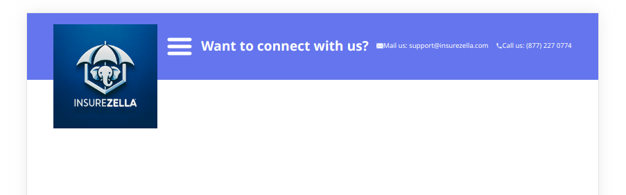

# a-teamwork-challenge

Tecnologias utilizadas:
Javascript
React
Vite
CSS

Paso a paso:
Lo primero que hice fue crear un proyecto base con Vite. Luego decidi comenzar por la navbar. En este proyecto utilice un criterio mobile-first. Es decir, elegi primero hacer todo el CSS teniendo en cuenta la referencia del mobil, para luego hacer el desktop utilizando media queries.

