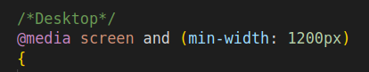

# a-teamwork-challenge

Tecnologias utilizadas:
Javascript
React 18.3.1
Vite 5.4.1
CSS

Como ejecutar localmente:
Descargar el repositorio y utilizar los comandos 

```
npm install
npm run dev
```


Paso a paso:
Lo primero que hice fue crear un proyecto base con Vite. Decidi dividir el diseño en distintas secciones y trabajarlas por separado, cada una en su propio componente de React. Asi fui trabajando un primer boceto de todas las partes. Las secciones que elegi con su nomenclatura correspondiente fueron:

Header


FindPlans


About


Types


LearnMore


Help


Footer


Decidi comenzar por Header e ir trabajando las secciones en orden. En este proyecto utilice un criterio mobile-first. Es decir, elegi primero hacer todo el CSS teniendo en cuenta la referencia del mobile, para luego hacer el desktop utilizando media queries. (Para referencia, intente seguir el diseño al maximo utilizando la vista de devtools correspondiente al iPhone 14 Pro Max, chequeando a su vez con otros dispositivos)


Mi idea en esta primera etapa no era hacer una implementacion pixel perfect, sino una aproximacion de todas las secciones para despues encarar los detalles mas finos.


En el caso del footer, decidi para la vista mobile dividirlo en 2 secciones, por lo que cree un componente dedicado llamado FooterMobile. Mas tarde cree un component FooterDesktop separado para la vista web.


Una vez terminadas todas las secciones en la vista mobile, me dispuse a implementar la version web, utilizando media queries para los cambios necesarios. 

Para esto cree una branch aparte llamada desktopView.
Todos las adaptaciones a desktop las realice utilizando media queries de la siguiente manera



Una vez realizados todos los cambios en la desktopView, mergee con main y me dispuse a arreglar los detalles mas finos (colores, estileado de botones, etc.)